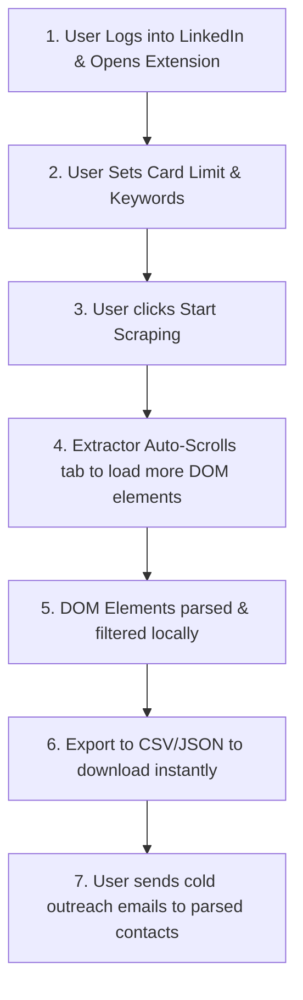

# 🧙‍♂️ Job Wizard

> A simple, client-side browser extension that extracts already loaded DOM elements from LinkedIn to structure job posts and generate direct email/contact leads. **Zero third-party APIs, zero external databases, and zero account risk.**

---

## 💡 The Problem

As a job seeker, manually finding and applying to high-quality jobs is incredibly slow.
* **The Manual Bottleneck**: A normal job seeker manually applies to a maximum of 5–10 jobs per day because finding the actual job posts, hunting down recruiter email leads, and figuring out where to send the email (and with what context) takes hours.
* **The Account Flagging Risk**: While LinkedIn is the premier common platform for both job seekers and recruiters, active automated scraping of LinkedIn via traditional HTTP scrapers or third-party APIs **will quickly flag and suspend your account**.

---

## 🛡️ The Solution: Safe, Client-Side DOM Extraction

Job Wizard takes a completely different, safe approach:
* **No Traditional Scraping**: We do not scrape LinkedIn's backend APIs or send automated network requests.
* **DOM-Only Extraction**: When you open LinkedIn, the details of job posts and recruiter announcements are **already loaded inside your browser**. You already have the data!
* **Structured Retrieval**: Job Wizard simply provides an organized way to pull that already loaded DOM data, filters out noise, and outputs the information in a beautifully structured format so you can extract recruiter emails and details instantly.
* **Complete Safety**: Because it runs purely on the client side inside the user's current session to extract loaded elements, it acts just like a human reader—leaving your account completely safe and unflagged.

---

## ⚡ Purely Client-Side & Zero Setup

* 🔌 **Zero Third-Party Dependencies**: No external scraping APIs, cloud databases, or proxy configurations.
* 📦 **No Setup Hassle**: Just load the extension, click the icon, and execute.
* 🔒 **100% Private**: Your data never leaves your browser. All DOM processing and extraction happen entirely locally.

---

## 🔄 Process Flow



1. **Access LinkedIn**: Open LinkedIn in your browser (logged in) and open the **Job Wizard** popup.
2. **Configure Limits**: Select how many job post cards you want to capture and provide your target keywords.
3. **Execute**: Click **"Start Scraping"**. The DOM extractor automatically scrolls the page to trigger LinkedIn's native content loading, captures the loaded DOM elements on the fly, and logs progress in real time.
4. **Download Instantly**: Once the limit is reached, export the compiled details into a clean **CSV** or **JSON** file ready for outreach templates or cold emails.

---

## ✨ Features & Extracted Details

* 👤 **Author/Recruiter Name** & profile details.
* 📧 **Email Extraction**: Automatically parses emails listed in post descriptions.
* 📞 **Contact Information**: Smart local formatting recognition for phone numbers.
* 💼 **Job Classification**: Auto-filters whether a post describes a **Remote**, **Hybrid**, or **On-site** role.
* 🔗 **Reference Links**: Web addresses and application links mentioned in the posts.
* 📝 **Full Commentary**: Captures the raw text of the post so you always have context for your email templates.

---

## 🛠️ Developer Setup

### 📋 Prerequisites

Ensure you have [Node.js](https://nodejs.org/) installed (v18.x or higher).

### ⚙️ Installation & Development

1. **Install dependencies**:
   ```bash
   npm install
   ```

2. **Start the development server**:
   ```bash
   npm run dev
   ```
   *This launches a new browser instance with Job Wizard loaded and hot-reloading active.*

3. **Build the extension**:
   ```bash
   npm run build
   ```
   *Compiles the extension into production-ready assets inside the `.output/chrome-mv3` folder.*
